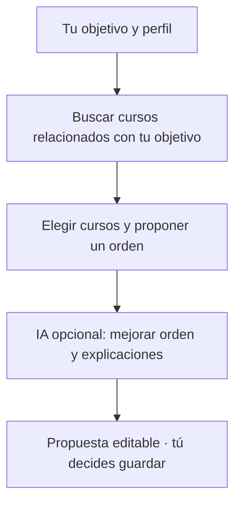

  

<h1 align="center">Learning Path</h1>

  <strong>De tener opciones a tener un plan.</strong> 
  Tu objetivo, los cursos de DevTalles y un camino para seguir aprendiendo.

  <a href="https://codequest2026.optarys.com/"><strong>🚀 Explorar la aplicación</strong></a> ·
  <a href="#cómo-recomendamos-tu-ruta">🧠 Cómo recomendamos</a> ·
  <a href="#dentro-del-proyecto">🔎 Ver el código</a>

---

## 🧭 Tu recorrido, a tu manera

Learning Path te ayuda a decidir **qué aprender y en qué orden**. Puedes recibir una recomendación según tu perfil o construir una ruta manualmente. Tú decides qué conservar y cuándo guardarla.

| | Lo que puedes hacer |
| --- | --- |
| 🧠 **Descubrir** | Explorar el catálogo y recibir una propuesta personalizada. |
| ✍️ **Crear** | Elegir, ordenar y ajustar tus propios cursos. |
| ✅ **Avanzar** | Guardar rutas, marcar cursos completados y añadir notas y prioridades. |
| 🗺️ **Compartir** | Exportar tu recorrido como un mapa en PNG. |

**Discord y Google · Español e inglés · Tema claro y oscuro**

Las clases se estudian en DevTalles. Aquí organizas tu aprendizaje; el progreso se registra por ti y las notas y prioridades son locales al navegador.

## 🧠 Cómo recomendamos tu ruta

Partimos de lo que quieres aprender y buscamos cursos reales del catálogo que te ayuden a conseguirlo.

1. **Buscamos por significado.** Comparamos tu objetivo, intereses y experiencia con el contenido de los cursos. No hace falta que el título repita exactamente tus palabras.
2. **Elegimos y ordenamos.** Proponemos hasta seis cursos relacionados, considerando sus temas, nivel y requisitos verificados, además de lo que ya sabes. Buscamos variedad sin alejarnos de tu objetivo.
3. **Explicamos por qué.** La IA puede ajustar el orden y explicar el aporte de cada curso. Solo utiliza los cursos que el motor eligió; si falla, conservamos la propuesta original.

> **Ejemplo:** para «web con Python», el motor prioriza fundamentos y cursos del tema. Puede proponer menos de seis para evitar rellenar la ruta con tecnologías ajenas al objetivo. Los requisitos orientan; no bloquean cursos.

La recomendación es una **propuesta que puedes revisar y ajustar**. Tú decides cuándo guardarla.

## 🛠️ Dentro del proyecto

| Experiencia | Aplicación y datos | Recomendación |
| --- | --- | --- |
| React · TypeScript · Vite | ASP.NET Core · EF Core | Python · FastAPI |
| React Router · i18next | PostgreSQL · pgvector | Embeddings locales · Groq |

Cada pieza tiene una responsabilidad: el frontend presenta y edita, la API coordina y persiste, Python genera vectores y el motor elige el recorrido.

<strong>🔎 Explorar la implementación y sus pruebas</strong>

- [Perfil del usuario](frontend/src/features/questionnaire/model/preferencesMapping.ts) → [embeddings](backend/embedding-worker/embedding_service.py) → [búsqueda](backend/Application/Routes/Queries/GetSemanticRecommendationQuery.cs).
- [Selección y orden](backend/Application/Routes/HybridSemanticRecommendationEngine.cs) → [refinamiento validado](backend/Application/Routes/RouteRefinementService.cs) → [guardado](backend/Application/Routes/Commands/SaveLearningRouteCommand.cs).
- [Pruebas del motor](backend/tests/CodeQuest2026.Server.Tests/HybridSemanticRecommendationEngineTests.cs) · [Pruebas de refinamiento](backend/tests/CodeQuest2026.Server.Tests/GroqRouteRefinerTests.cs) · [Pruebas del frontend](frontend/tests/README.md).
- [Arquitectura](docs/architecture.md) · [Documentación del frontend](frontend/README.md) · [Documentación del backend](backend/README.md).

---

   
  <strong>Una meta. Un punto de partida. Tu propio recorrido.</strong> 
  <a href="https://codequest2026.optarys.com/">Conoce Learning Path →</a>

Código propio bajo [licencia MIT](LICENSE). Las marcas, miniaturas y contenidos de terceros pertenecen a sus respectivos titulares.
