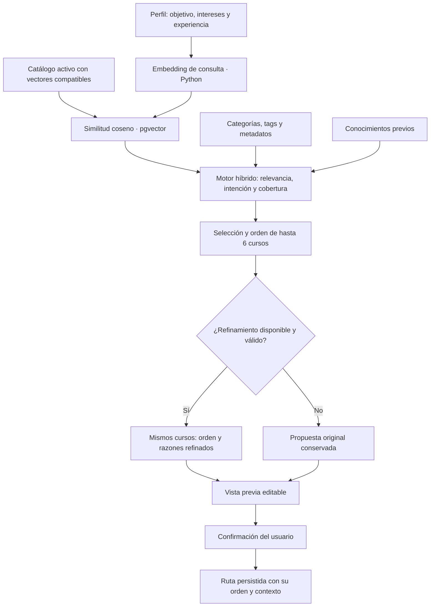
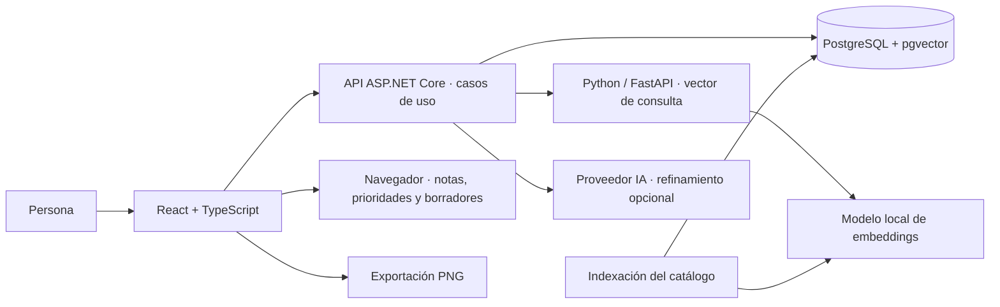

<p align="center">
  
</p>

<h1 align="center">Learning Path · CODE QUEST 2026</h1>

<p align="center">
  <strong>Una meta. Un punto de partida. Tu propio recorrido.</strong><br />
  Convertimos un catálogo de cursos en un camino de aprendizaje que puedes entender, ajustar y retomar.
</p>

<p align="center">
  <a href="https://codequest2026.optarys.com/"><strong>🚀 Explorar la aplicación</strong></a> ·
  <a href="#el-corazón-del-proyecto">🧠 Cómo recomendamos</a> ·
  <a href="#un-ejemplo-de-principio-a-fin">🧭 Ver un ejemplo</a> ·
  <a href="#recorrido-por-el-código">🔎 Explorar el código</a>
</p>

<p align="center">
  React + TypeScript &nbsp; / &nbsp; ASP.NET Core &nbsp; / &nbsp; PostgreSQL + pgvector &nbsp; / &nbsp; Python + embeddings
</p>

---

## Aprender empieza antes del primer curso

Tener muchos cursos disponibles no siempre significa saber por dónde empezar. Entre tecnologías, niveles y objetivos, falta una pieza: **convertir las opciones en un plan con sentido**.

Learning Path conecta el catálogo de **DevTalles** con el objetivo y el punto de partida de cada persona. La propuesta incluye cursos reales, un orden de estudio y una explicación de su aporte. Después, el usuario conserva el control: puede ajustar el recorrido, guardarlo y registrar su avance.

> **Nuestra decisión central:** recomendar, explicar y dejar decidir. La plataforma acompaña el aprendizaje; el cuestionario no es un requisito para explorarla ni para crear una ruta manual.

Este repositorio muestra cómo construimos esa experiencia. Para conocer el producto, puedes entrar directamente a **[codequest2026.optarys.com](https://codequest2026.optarys.com/)**; esta portada se centra en su implementación, no en la instalación.

## Dos maneras de construir tu camino

| 🧠 Con una recomendación | ✍️ Con tus propias decisiones |
| --- | --- |
| Respondes el perfil de aprendizaje. | Seleccionas cursos del catálogo. |
| El motor combina significado, asociaciones temáticas y señales de preparación. | Defines el nombre, la descripción y el orden. |
| Recibes una propuesta editable de hasta **6 cursos**. | Construyes una ruta de **1 a 30 cursos**, sin repetir. |
| Revisas las razones y decides qué conservar. | No necesitas completar el cuestionario. |
| **Guardar es una acción explícita.** | **Guardar es una acción explícita.** |

Una vez guardadas, ambas rutas comparten consulta, edición, reemplazo de cursos, progreso, notas, prioridades y exportación visual.

<details>
<summary><strong>✨ Qué puedes experimentar en la aplicación</strong></summary>

| Momento | Lo que construimos |
| --- | --- |
| Descubrir | Landing educativa y catálogo público, sin obligar a iniciar sesión. |
| Entrar | Discord y Google cuando está configurado. Cada cuenta conserva sus datos; no se fusionan automáticamente por correo. |
| Elegir | Constructor manual o perfil para una recomendación personalizada. |
| Entender | Mapa del recorrido, razones por curso y explicación de la propuesta. |
| Ajustar | Ordenar, retirar o reemplazar cursos según el contexto de la pantalla. |
| Avanzar | Marcar cursos como No iniciado o Completado y consultar el resumen. |
| Organizar | Notas y prioridades por curso, guardadas en el navegador. |
| Compartir | Vista previa y PNG horizontal, cuadrado o vertical 9:16; paginación de rutas largas. |
| Sentirse cómodo | Español e inglés, temas claro/oscuro, diseño adaptable y atención al foco y al teclado. |

Las clases se ven en **DevTalles**. Learning Path organiza y enlaza el contenido; no aloja clases ni sincroniza automáticamente el avance con esa plataforma.

</details>

## El corazón del proyecto

### De un objetivo a una propuesta explicable

La recomendación tiene **dos etapas**: un motor híbrido selecciona y ordena cursos del catálogo; después, un proveedor de IA puede refinar ese orden y sus explicaciones. El motor base ya produce una propuesta sin depender del refinamiento generativo.



### 01 · Traducir el perfil a datos concretos

El frontend valida las respuestas y las transforma en un contrato estable antes de enviarlas a la API. Las tecnologías usan nombres canónicos en español, independientemente del idioma visual.

| Dato que llega al recomendador | Cómo interviene |
| --- | --- |
| **Objetivo** | Meta elegida; participa en el embedding y en la detección del tema central. |
| **Intereses** | Tecnologías seleccionadas; participan en el embedding y las asociaciones temáticas. |
| **Experiencia declarada** | Se transforma a principiante, intermedio o avanzado; participa en el texto del embedding y el refinamiento. |
| **Conocimientos previos** | Orientan preparación y orden; no se incluyen en el embedding de consulta. |
| **Idioma preferido** | Filtra cursos compatibles; aquellos sin idioma informado también pueden participar. |
| **Minutos por semana** | Permiten estimar semanas de contenido cuando hay duración disponible. |

<details>
<summary><strong>🔬 Precisión sobre el contrato actual del cuestionario</strong></summary>

El objetivo enviado corresponde al **resultado que la persona quiere conseguir**. El área organiza las tecnologías disponibles, pero no se envía como campo independiente. Experiencia práctica y contexto de sistemas existentes permanecen en el cuestionario y su resumen; actualmente no son campos del DTO del recomendador.

El mapeo utiliza **español** como idioma preferido y **60 minutos semanales** como valor fijo. Son valores de implementación, no una disponibilidad horaria preguntada al usuario. El idioma visual no cambia ese filtro.

El nivel declarado influye en la consulta semántica, pero el motor base **no aplica un peso independiente por nivel de usuario ni bloquea cursos avanzados**. Para ordenar usa el nivel publicado de cada curso y las señales de preparación descritas más adelante.

**Código:** [mapeo del perfil](frontend/src/features/questionnaire/model/preferencesMapping.ts) · [cliente de embeddings](backend/Infrastructure/Embeddings/PreferenceEmbeddingClient.cs).

</details>

### 02 · Representar el catálogo por su significado

Python prepara un texto por curso con **título, nivel, categorías y etiquetas**. Añade descripción, temario, resultados, habilidades, requisitos y público cuando los metadatos tienen procedencia admitida: no provienen del seed inferido y tienen una URL de fuente o fecha de verificación.

El modelo local configurado por defecto es **`Qwen/Qwen3-Embedding-0.6B`**, cargado con Sentence Transformers. Convierte los textos en vectores normalizados. Para las preferencias añade una instrucción de recuperación de cursos al objetivo, intereses y experiencia.

La indexación guarda **identificador de modelo, dimensión, hash del contenido y fecha de generación**. Si el modelo y el hash no cambiaron, omite recalcular ese curso. La preparación del catálogo ocurre separadamente de cada consulta.

**Por qué importa:** comparamos intención y contenido más allá de palabras exactas, manteniendo trazabilidad de la representación utilizada.

**Código:** [textos y embeddings](backend/embedding-worker/embedding_service.py) · [indexación incremental](backend/embedding-worker/embedding_cli.py).

### 03 · Recuperar candidatos compatibles

La API genera el vector de consulta y PostgreSQL calcula:

```text
similitud coseno = 1 − distancia coseno
```

Participan cursos **activos**, con vectores del **mismo modelo y dimensión** y compatibles con el idioma preferido. El filtro reconoce idioma base, variantes y cursos sin idioma informado. También admite excluir IDs para solicitar alternativas.

La consulta conserva **todo el conjunto compatible**, no únicamente los primeros vecinos: las asociaciones y la selección necesitan observar ese catálogo candidato. No es todavía una búsqueda aproximada limitada a un top-k.

**Código:** [consulta semántica y filtros](backend/Application/Routes/Queries/GetSemanticRecommendationQuery.cs).

### 04 · Combinar significado y contexto del catálogo

El motor **`semantic-graph-v6`** combina dos señales:

| Señal | Peso | Qué representa |
| --- | --- | --- |
| Similitud semántica normalizada | **82 %** | Cercanía entre consulta y contenido del curso. |
| Asociación temática | **18 %** | Coincidencias de categorías, tags, títulos y relaciones observadas en el catálogo candidato. |

```text
S = clamp((similitud_coseno + 1) / 2, 0, 1)
R = 0.82 × S + 0.18 × G

Si el título contiene Legacy y no fue solicitado:
R = max(0, R − 0.08)
```

**`R` expresa relevancia relativa, no probabilidad de éxito ni una promesa de aprendizaje.**

Se normalizan mayúsculas, acentos y nombres como `C#`, `.NET` y `Node.js`. Los alias son acotados: `web` se relaciona con frontend/backend con peso 0,45; `js` se reconoce como JavaScript.

Las coocurrencias categoría–tag permiten reconocer asociaciones indirectas. Se toma la más fuerte en lugar de sumar todos los tags. **Describen afinidad temática; no constituyen un grafo de prerrequisitos obligatorios.**

<details>
<summary><strong>🧩 Cómo resolvemos una intención compuesta, como «web con Python»</strong></summary>

Cuando se identifica categoría y tecnología, la asociación `G` distingue:

| Relación con la intención | G |
| --- | ---: |
| Comparte tema y dominio | 1,00 |
| Enseña fundamentos del tema en la categoría Fundamentos | 0,85 |
| Comparte únicamente dominio | 0,35 |
| Comparte únicamente tema | 0,15 |
| No coincide con esas señales | 0,00 |

Los tags mencionados **en el objetivo** prevalecen sobre intereses adicionales para definir el tema central. Si esa intención enfocada tiene cursos centrales, elimina candidatos con `G < 0,35` y admite **como máximo un complemento** con `0,35 ≤ G < 0,80`.

Puede devolver menos de seis cursos. No completa posiciones artificialmente con otras tecnologías solo porque pertenecen al mismo dominio. Mencionar Python como requisito tampoco demuestra que un curso enseñe Python.

Para intenciones no compuestas, la asociación indirecta usa:

```text
0.4 × peso_de_coincidencia × coocurrencias / frecuencia
```

Se toma el máximo entre señales admitidas para evitar que muchas etiquetas genéricas inflen el puntaje.

</details>

### 05 · Seleccionar con cobertura y preparación

La selección es incremental: escoge el siguiente candidato según relevancia, novedad temática y preparación, hasta seis cursos o hasta agotar candidatos elegibles.

```text
puntaje de selección = R + bonificación de novedad − penalización de preparación

bonificación: hasta 0.06 por proporción de tags aún no cubiertos
penalización: hasta 0.06 por proporción de temas requeridos aún desconocidos
```

La novedad se bonifica si hay asociación temática y tags. Cada elección actualiza temas cubiertos y habilidades acreditadas en los metadatos. Es una proyección para organizar el recorrido: no significa que el usuario ya haya adquirido esas habilidades ni marca cursos como completados. El ID desempata de forma determinista.

**Seleccionar no es ordenar.** El conjunto elegido se organiza con este criterio:

1. Cursos centrales antes de complementarios, para intenciones compuestas.
2. Nivel publicado: principiante, intermedio y avanzado; desconocido se trata como intermedio.
3. Proporción de requisitos temáticos pendientes.
4. Mayor relevancia.
5. ID para desempatar.

La preparación se recalcula tras cada curso colocado. Las habilidades y requisitos usados necesitan **fecha de verificación** y no pueden proceder de `inferred-seed-v1`. Se reconocen requisitos textuales de conocimiento y se descartan formulaciones negativas u opcionales. Es una heurística apoyada en metadatos, no una validación académica de dependencias.

Cada curso recibe posición, puntaje, razón y semanas estimadas cuando hay duración y disponibilidad válidas:

```text
semanas de contenido = ceil(duración del curso / minutos por semana)
```

La estimación expresa tiempo de contenido; no mide práctica ni tiempo hasta dominar una tecnología. Los requisitos pendientes se explican; **no bloquean el curso**.

**Código:** [motor híbrido completo](backend/Application/Routes/HybridSemanticRecommendationEngine.cs).

### 06 · Refinar con IA dentro de límites verificables

El endpoint V2 entrega la propuesta base a `RouteRefinementService`. Se registra **Groq** detrás de una interfaz de proveedor; el modelo predeterminado del adaptador es `openai/gpt-oss-20b`. Son valores del código, no una afirmación sobre la configuración del despliegue.

El proveedor recibe el perfil y **solo los cursos seleccionados**. Puede reorganizarlos y redactar explicación y razones específicas. Las instrucciones exigen fundamentar dependencias en requisitos y habilidades verificados, evitar promesas y tratar preferencias y metadatos como datos no confiables.

La respuesta está restringida por JSON Schema y se valida de nuevo en la aplicación:

- El número de cursos debe coincidir con la propuesta original.
- Cada ID original aparece **exactamente una vez**.
- No se aceptan cursos nuevos, duplicados ni omitidos.
- Se validan propiedades y textos de explicación y razones.
- Se conservan puntajes y estimaciones; se actualizan posiciones y razones.

> **La IA mejora la presentación y puede ajustar el orden; catálogo y motor delimitan qué cursos puede utilizar.** Las instrucciones reducen afirmaciones sin fundamento, aunque no equivalen a comprobar automáticamente cada frase generada.

Si el proveedor no está configurado, falla, tarda demasiado o devuelve datos inválidos, se conserva la propuesta original. `refinementStatus` distingue `applied` de casos como `not_configured`, `timeout` o `invalid_response`.

Esta recuperación corresponde al **refinamiento**: sin servicio de embeddings o índice compatible no existe propuesta base que recuperar, y la API informa ese problema.

**Código:** [orquestación V2](backend/Application/Routes/Queries/GetSemanticRecommendationV2Query.cs) · [refinamiento y validación](backend/Application/Routes/RouteRefinementService.cs) · [Groq](backend/Infrastructure/Groq/GroqProvider.cs).

### 07 · Convertir una propuesta en una ruta propia

Generar una recomendación **no inserta una ruta guardada**. El frontend crea un borrador editable. Una propuesta ya generada puede conservarse en `sessionStorage`, con comprobación de propietario, para recuperarla dentro de esa sesión del navegador cuando el almacenamiento está disponible.

Al confirmar, `POST /routes` valida identidad del usuario, cursos activos, ausencia de duplicados y límite de 1 a 30 cursos. El arreglo enviado determina las posiciones persistidas. Las rutas recomendadas conservan una **copia de las preferencias utilizadas**; las manuales no las exigen y guardan un snapshot vacío.

Después se pueden consultar varias rutas y editar sus recorridos. En el detalle guardado, reemplazar durante edición modifica el borrador y espera Guardar cambios. El resumen de avance se calcula como cursos completados dividido entre cursos totales; no está ponderado por duración.

**Código:** [borrador y recuperación](frontend/src/features/routes/model/draftRoute.ts) · [persistencia](backend/Application/Routes/Commands/SaveLearningRouteCommand.cs).

## Un ejemplo de principio a fin

> **Objetivo ilustrativo:** «Aprender a desarrollar aplicaciones web con Python».

Este caso está representado en las pruebas con un catálogo controlado. Explica la lógica; no promete que producción devuelva siempre los mismos cursos.

| Paso | Decisión del sistema |
| --- | --- |
| Interpretar | Reconoce web y Python como tema explícito. |
| Comparar | Calcula cercanía semántica aunque los títulos no repitan la frase completa. |
| Enfocar | Favorece Python aplicado a web y sus fundamentos; otros intereses no desplazan el núcleo. |
| Seleccionar | En el escenario de prueba incluye fundamentos, Django y FastAPI; excluye automatización con Python y JavaScript ajeno al núcleo. |
| Ordenar | Coloca fundamentos primero y recalcula preparación antes de los siguientes cursos. |
| Explicar | Identifica aporte y requisitos pendientes; si fundamentos acredita Python, no lo anuncia después como requisito sin cubrir. |
| Confirmar | Entrega una vista previa. El usuario decide cuándo guardarla. |

<details>
<summary><strong>✅ Evidencia en pruebas, no solo en una descripción</strong></summary>

[HybridSemanticRecommendationEngineTests](backend/tests/CodeQuest2026.Server.Tests/HybridSemanticRecommendationEngineTests.cs) cubre categorías, diversidad de tags, asociaciones indirectas, web amplio, web con Python, backend con Go, objetivos explícitos y requisitos verificados o negados.

[GroqRouteRefinerTests](backend/tests/CodeQuest2026.Server.Tests/GroqRouteRefinerTests.cs) comprueba refinamiento y recuperación ante respuestas inválidas, errores, ausencia de configuración y timeout. El [contrato de proveedores](backend/tests/CodeQuest2026.Server.Tests/AiProviderContractTests.cs) prueba la separación entre orquestación y adaptador.

Las [pruebas del worker](backend/embedding-worker/test_embedding_service.py) caracterizan servicio y textos. Las [pruebas del frontend](frontend/tests/README.md) cubren contratos, URLs, borradores, almacenamiento y cancelación; hay además una fixture de interacciones con datos ficticios.

Estas pruebas documentan escenarios concretos; no garantizan la relevancia de toda recomendación ni sustituyen una evaluación longitudinal del aprendizaje.

</details>

## Una arquitectura con responsabilidades claras



| Capa | Responsabilidad y decisión |
| --- | --- |
| **Experiencia** | React, TypeScript y React Router; features de autenticación, catálogo, cuestionario y rutas. Estado local y contextos de sesión/notificaciones. |
| **Sistema visual** | CSS con tokens, Lucide, ilustraciones educativas, Framer Motion e i18next. Temas y movimiento reducido donde está implementado. |
| **Límite HTTP** | Cliente compartido y parsers que validan datos externos antes de tratarlos como modelos del frontend. |
| **Aplicación** | ASP.NET Core 10 y casos de uso con MediatR: consultar, recomendar, guardar y actualizar progreso son responsabilidades distintas. |
| **Persistencia** | Entity Framework Core y PostgreSQL conservan usuarios, preferencias, catálogo, asociaciones, rutas y progreso; pgvector calcula similitud. |
| **Representación semántica** | Python/FastAPI encapsula el modelo local; .NET consume vectores y no carga el modelo. |
| **Refinamiento** | Interfaz de proveedor y respuestas estructuradas; un fallo generativo conserva la propuesta válida. |

### Dónde vive cada decisión del usuario

| Información | Persistencia | Alcance |
| --- | --- | --- |
| Rutas y orden | PostgreSQL, vinculados al usuario | Recuperables con esa cuenta. |
| Progreso | PostgreSQL | UI de 0 % o 100 %; contrato con porcentajes. No se sincroniza con DevTalles. |
| Contexto de recomendación | Snapshot en la ruta | Registra preferencias utilizadas al guardar. |
| Propuesta pendiente | `sessionStorage`, comprobando usuario | Recuperación de la propuesta lista, no persistencia permanente. |
| Notas y prioridades | `localStorage`, por ruta y curso | Locales al navegador, sin sincronización entre dispositivos. |
| Borrador manual | Estado de pantalla | Sin recuperación persistente al abandonar la página. |
| Imagen compartida | html-to-image en el navegador | Exporta el mapa; no modifica la ruta. |

<details>
<summary><strong>🛠️ Alcance actual y siguientes decisiones de ingeniería</strong></summary>

Distinguimos los límites de las funcionalidades implementadas:

- Requisitos como señales textuales, no certificación de dependencias entre cursos.
- Consulta de todos los candidatos compatibles; un catálogo mucho mayor requeriría medir y diseñar recuperación limitada.
- Recuperar una propuesta lista no resuelve todavía la política de generación al abandonar su pantalla.
- El borrador del cuestionario necesita aislamiento completo por cuenta y migración de entradas antiguas sin propietario.
- Sincronizar notas y prioridades requeriría contrato y persistencia adicionales.
- La relevancia se comprueba con escenarios controlados; resultados educativos y satisfacción necesitan evaluación con usuarios.

La [revisión técnica del frontend](frontend/docs/frontend-review.md) detalla hallazgos, correcciones y fases pendientes. La [arquitectura](docs/architecture.md) amplía el contexto.

</details>

## Recorrido por el código

Para evaluar el núcleo de la solución, recomendamos este orden de lectura:

| Qué explorar | Punto de entrada |
| --- | --- |
| **1. Perfil → contrato** | [preferencesMapping.ts](frontend/src/features/questionnaire/model/preferencesMapping.ts) |
| **2. Texto → vector** | [embedding_service.py](backend/embedding-worker/embedding_service.py) |
| **3. Catálogo → índice** | [embedding_cli.py](backend/embedding-worker/embedding_cli.py) |
| **4. Consulta → candidatos** | [GetSemanticRecommendationQuery.cs](backend/Application/Routes/Queries/GetSemanticRecommendationQuery.cs) |
| **5. Candidatos → recorrido** | [HybridSemanticRecommendationEngine.cs](backend/Application/Routes/HybridSemanticRecommendationEngine.cs) |
| **6. Recorrido → razones refinadas** | [RouteRefinementService.cs](backend/Application/Routes/RouteRefinementService.cs) |
| **7. Respuesta → propuesta editable** | [MyPathPage.tsx](frontend/src/features/routes/pages/MyPathPage.tsx) |
| **8. Confirmación → ruta guardada** | [SaveLearningRouteCommand.cs](backend/Application/Routes/Commands/SaveLearningRouteCommand.cs) |

```text
frontend/src/features/        Autenticación, catálogo, perfil y rutas
frontend/src/components/      Layout y componentes compartidos
frontend/src/lib/             Transporte, validación y utilidades de límite
frontend/src/styles/          Tokens y estilos globales
backend/Application/          Casos de uso, contratos y motor de recomendación
backend/Infrastructure/       Persistencia y adaptadores externos
backend/embedding-worker/     Textos, modelo local, indexación y servicio de vectores
backend/tests/                Motor, contratos, autenticación y mutaciones
frontend/tests/               Regresiones de datos y fixture de interacciones
```

<details>
<summary><strong>📚 Documentación especializada para colaboradores</strong></summary>

Los detalles de desarrollo se mantienen fuera de esta presentación:

- [Frontend y verificaciones](frontend/README.md)
- [Backend y endpoints](backend/README.md)
- [Servicio de embeddings](backend/embedding-worker/README.md)
- [Sistema de diseño](docs/design-system.md) · [Internacionalización](docs/i18n.md)
- [Migraciones](backend/docs/MIGRATIONS.md) · [Contribución](CONTRIBUTING.md)

</details>

---

<p align="center">
  
  <br />
  <strong>De tener opciones a tener un plan.</strong><br />
  Un recorrido explicable, editable y construido alrededor de tu próximo paso.<br /><br />
  <a href="https://codequest2026.optarys.com/"><strong>Explorar Learning Path →</strong></a>
</p>

### Licencia y recursos

El código propio se publica bajo la [licencia MIT](LICENSE). Nombres, logos, miniaturas y contenidos de terceros, incluidos DevTalles y sus cursos, pertenecen a sus respectivos titulares. Su uso no concede derechos sobre esas marcas ni materiales.
