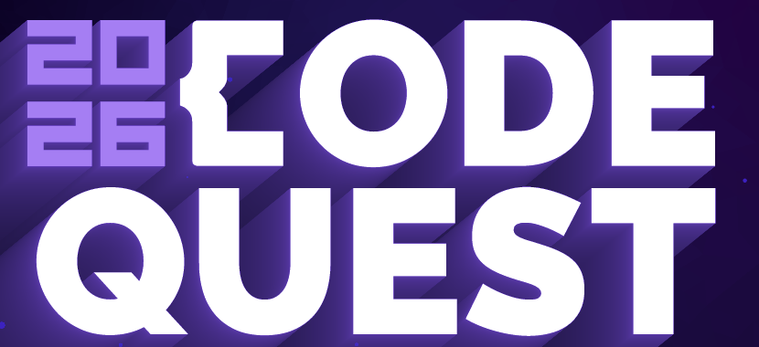
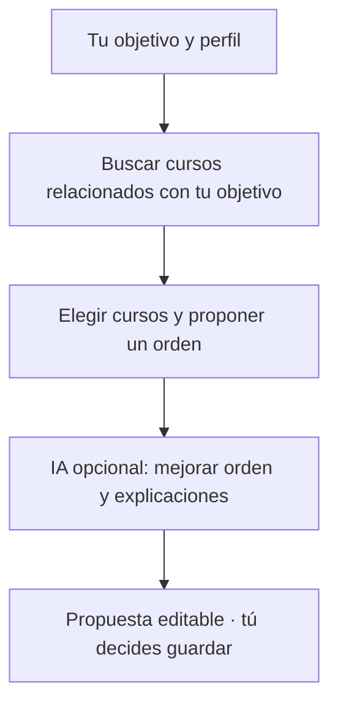
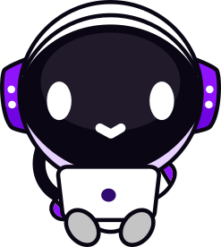

<p align="center">
  
</p>

<h1 align="center">Learning Path</h1>

<p align="center">
  <strong>De tener opciones a tener un plan.</strong><br />
  Tu objetivo, los cursos de DevTalles y un camino para seguir aprendiendo.
</p>

<p align="center">
  <a href="https://codequest2026.optarys.com/"><strong>🚀 Explorar la aplicación</strong></a> ·
  <a href="#cómo-recomendamos-tu-ruta">🧠 Cómo recomendamos</a> ·
  <a href="#iniciar-localmente">Iniciar localmente</a> ·
  <a href="#dentro-del-proyecto">🔎 Ver el código</a>
</p>

---

## 🧭 Tu recorrido, a tu manera

Learning Path te ayuda a decidir **qué aprender y en qué orden**. Puedes recibir una recomendación según tu perfil o construir una ruta manualmente. Tú decides qué conservar y cuándo guardarla.

| | Lo que puedes hacer |
| --- | --- |
| 🧠 **Descubrir** | Explorar el catálogo y recibir una propuesta personalizada. |
| ✍️ **Crear** | Elegir, ordenar y ajustar tus propios cursos. |
| ✅ **Avanzar** | Guardar rutas, marcar cursos completados y añadir notas y prioridades. |
| 🗺️ **Compartir** | Exportar tu recorrido como un mapa en PNG. |

**Discord y Google · Español e inglés · Tema claro y oscuro**

Las clases se estudian en DevTalles. Aquí organizas tu aprendizaje; el progreso se registra por ti y las notas y prioridades son locales al navegador.

## 🧠 Cómo recomendamos tu ruta

Partimos de lo que quieres aprender y buscamos cursos reales del catálogo que te ayuden a conseguirlo.



1. **Buscamos por significado.** Comparamos tu objetivo, intereses y experiencia con el contenido de los cursos. No hace falta que el título repita exactamente tus palabras.
2. **Elegimos y ordenamos.** Proponemos hasta seis cursos relacionados, considerando sus temas, nivel y requisitos verificados, además de lo que ya sabes. Buscamos variedad sin alejarnos de tu objetivo.
3. **Explicamos por qué.** La IA puede ajustar el orden y explicar el aporte de cada curso. Solo utiliza los cursos que el motor eligió; si falla, conservamos la propuesta original.

> **Ejemplo:** para «web con Python», el motor prioriza fundamentos y cursos del tema. Puede proponer menos de seis para evitar rellenar la ruta con tecnologías ajenas al objetivo. Los requisitos orientan; no bloquean cursos.

La recomendación es una **propuesta que puedes revisar y ajustar**. Tú decides cuándo guardarla.

<a id="iniciar-localmente"></a>

## 🚀 Iniciar el proyecto localmente

El arranque con Docker Compose incluye PostgreSQL con pgvector, el worker de
embeddings y `web-app`, que sirve el frontend y la API desde el mismo puerto.

### 1. Preparar el entorno

Necesitas Git, Docker con Docker Compose y el motor de Docker iniciado
(en Windows, Docker Desktop con contenedores Linux). También necesitas acceso
a internet para construir las imágenes y descargar el modelo de embeddings,
credenciales de Discord y una clave de Groq. Google es opcional.
No necesitas instalar .NET, Node.js ni Python en tu equipo para este arranque.

Abre una terminal en la **raíz del repositorio**, donde está `compose.yaml`.
Los comandos siguientes usan PowerShell. Si todavía no tienes `.env`, créalo:

```powershell
Copy-Item .env.example .env
```

### 2. Completar `.env`

Ajusta el archivo para que contenga estas variables. Sustituye los valores
`TU_...` por tus credenciales y elige una contraseña para PostgreSQL:

```dotenv
POSTGRES_DB=codequest2026
POSTGRES_USER=codequest
POSTGRES_PASSWORD=TU_PASSWORD_POSTGRES
POSTGRES_PORT=5432

ConnectionStrings__DefaultConnection="Host=postgres;Port=5432;Database=${POSTGRES_DB};Username=${POSTGRES_USER};Password=${POSTGRES_PASSWORD}"

EMBEDDING_MODEL=Qwen/Qwen3-Embedding-0.6B
EMBEDDING_REVISION=main
EMBEDDING_SERVICE_URL=http://embeddings:8765/

DISCORD_CLIENT_ID=TU_CLIENT_ID
DISCORD_CLIENT_SECRET=TU_CLIENT_SECRET
DISCORD_CALLBACK_PATH=/auth/discord/callback
DISCORD_FORCE_HTTPS_CALLBACK=false

GOOGLE_CLIENT_ID=
GOOGLE_CLIENT_SECRET=

Groq__ApiKey=TU_CLAVE_GROQ
Groq__Model=openai/gpt-oss-20b
```

La API se conecta a `postgres:5432` dentro de Docker. `POSTGRES_PORT` es el puerto
publicado en tu equipo y no cambia ese puerto interno. El ejemplo utiliza la base
local creada por Compose; no necesitas acceso a la base del equipo.

Obtén tus propias credenciales en [Discord Developer Portal](https://discord.com/developers/applications),
[Google Auth Platform](https://console.cloud.google.com/auth/clients) (opcional) y
[Groq Console](https://console.groq.com/keys). La contraseña de PostgreSQL la eliges tú.

El Compose actual exige Discord y Groq; Google puede quedar vacío. No subas
`.env` con credenciales al repositorio. Conserva el modelo y la revisión de
embeddings del ejemplo para que coincidan con los vectores del seed.

En la aplicación de Discord, registra el callback
`http://localhost:8080/auth/discord/callback`. Si habilitas Google, registra
`http://localhost:8080/auth/google/callback` en su cliente OAuth. Cambia `8080`
en ambas URLs si cambias el puerto publicado de `web-app` en `compose.yaml`. Consulta las guías de
[Discord](backend/docs/DISCORD_OAUTH.md) y [Google](backend/docs/GOOGLE_OAUTH.md).

Este archivo permite usar HTTP local y las cookies de autenticación de desarrollo.
Definir `ASPNETCORE_ENVIRONMENT` solo en `.env` no basta: el Compose principal
actual no transmite esa variable al contenedor. Usa este archivo adicional solo
para desarrollo; un despliegue público requiere la configuración de HTTPS correspondiente.

### 3. Construir e iniciar

```powershell
docker compose -f compose.yaml --build -d
```

La validación indica el nombre de cualquier variable obligatoria ausente o vacía.
La primera construcción y descarga del modelo pueden tardar varios minutos.

Cuando PostgreSQL y el worker están saludables, `web-app` aplica las migraciones,
carga primero `Seed DataCourses.sql` y después `Seed Embeddings.sql`, y finalmente
inicia el servidor. Los seeds actuales contienen **91 cursos y 91 embeddings**.
La carga queda registrada para no repetirse en cada arranque. Si falla un seed,
se revierten ambos y el servidor web no inicia; revisa los logs antes de reintentar.

### 4. Abrir y comprobar

Con el puerto `8080:8080` definido en `compose.yaml`, abre:

| Dirección | Uso |
| --- | --- |
| [http://localhost:8080](http://localhost:8080) | Aplicación web. |
| [http://localhost:8080/swagger](http://localhost:8080/swagger) | API interactiva en Development. |
| [http://localhost:8080/health/api](http://localhost:8080/health/api) | Disponibilidad de la API. |
| [http://localhost:8080/health/db](http://localhost:8080/health/db) | Conexión con PostgreSQL. |

Inicia sesión desde la aplicación para crear rutas y registrar progreso. Si un
puerto está ocupado, cambia el primer `8080` de `ports` en `web-app` o cambia
`POSTGRES_PORT` en `.env`, según corresponda, y recrea los
servicios. Actualiza también las URLs y los callbacks OAuth si cambias el puerto web.
`API_PORT` ya no se utiliza en el Compose actual.

Para detener el proyecto conservando los datos y la caché del modelo:

```powershell
docker compose -f compose.yaml -f compose.local.yaml down
```

Los volúmenes `postgres_data` y `huggingface_cache` persisten entre arranques.
Para desarrollar sin Docker, sigue las instrucciones del
[backend](backend/README.md), el [frontend](frontend/README.md) y el
[worker](backend/embedding-worker/README.md).


## 🛠️ Dentro del proyecto

| Experiencia | Aplicación y datos | Recomendación |
| --- | --- | --- |
| React · TypeScript · Vite | ASP.NET Core · EF Core | Python · FastAPI |
| React Router · i18next | PostgreSQL · pgvector | Embeddings locales · Groq |

Cada pieza tiene una responsabilidad: el frontend presenta y edita, la API coordina y persiste, Python genera vectores y el motor elige el recorrido.

<details>
<summary><strong>🔎 Explorar la implementación y sus pruebas</strong></summary>

- [Perfil del usuario](frontend/src/features/questionnaire/model/preferencesMapping.ts) → [embeddings](backend/embedding-worker/embedding_service.py) → [búsqueda](backend/Application/Routes/Queries/GetSemanticRecommendationQuery.cs).
- [Selección y orden](backend/Application/Routes/HybridSemanticRecommendationEngine.cs) → [refinamiento validado](backend/Application/Routes/RouteRefinementService.cs) → [guardado](backend/Application/Routes/Commands/SaveLearningRouteCommand.cs).
- [Pruebas del motor](backend/tests/CodeQuest2026.Server.Tests/HybridSemanticRecommendationEngineTests.cs) · [Pruebas de refinamiento](backend/tests/CodeQuest2026.Server.Tests/GroqRouteRefinerTests.cs) · [Pruebas del frontend](frontend/tests/README.md).
- [Arquitectura](docs/architecture.md) · [Documentación del frontend](frontend/README.md) · [Documentación del backend](backend/README.md).

</details>

---

<p align="center">
  <br />
  <strong>Una meta. Un punto de partida. Tu propio recorrido.</strong><br />
  <a href="https://codequest2026.optarys.com/">Conoce Learning Path →</a>
</p>

Código propio bajo [licencia MIT](LICENSE). Las marcas, miniaturas y contenidos de terceros pertenecen a sus respectivos titulares.
