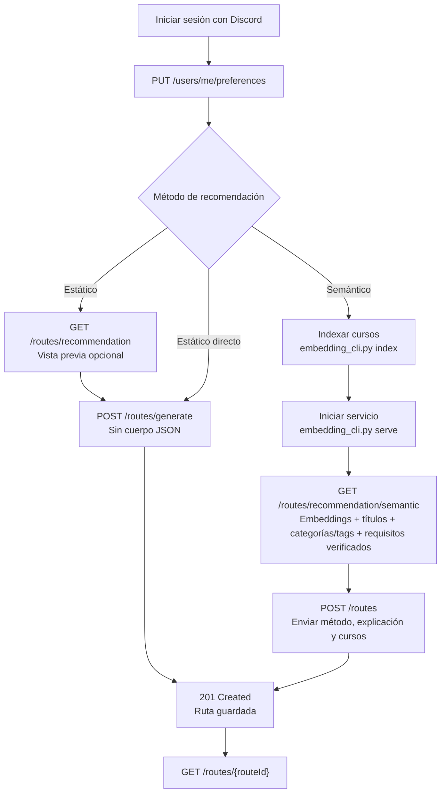

# CodeQuest2026 — Backend

Backend ASP.NET Core de CodeQuest2026, un proyecto para recomendar cursos y construir rutas de aprendizaje.

## Estado actual

Autenticación con Discord disponible mediante `/auth/discord`, callback OAuth
y consulta de sesión en `/auth/me`. Ver [configuración y pruebas](docs/DISCORD_OAUTH.md).

- Catálogo inicial de 72 cursos de DevTalles.
- 9 categorías y 96 tags relacionados muchos a muchos con cursos.
- Metadatos inferidos para pruebas: descripción, temario sugerido, objetivos, habilidades, prerrequisitos y público.
- Extracción de metadatos públicos de las 72 páginas de cursos, con fuente y fecha; importación SQL revisable.
- Índices de filtrado por estado/nivel, título, categoría y tag.
- Almacenamiento de embeddings mediante pgvector.
- Health checks, documento OpenAPI y panel interactivo Swagger en desarrollo.

El cuestionario y el seguimiento de progreso todavía no están implementados en este backend.

Las preferencias se pueden guardar con `PUT /users/me/preferences` y consultar con
`GET /users/me/preferences`. `isNewUser` en `/auth/me` y `/users/me` es verdadero
hasta que se guardan las preferencias. Las rutas ya analizadas se guardan con
`POST /routes` y se consultan con `GET /routes` o `GET /routes/{routeId}`.
El motor estático ofrece una vista previa con `GET /routes/recommendation` y genera
y guarda la ruta con `POST /routes/generate`.
La búsqueda con embeddings se consulta con `GET /routes/recommendation/semantic`;
devuelve una propuesta sin guardarla. `POST /routes/generate` usa `static-v1`,
no la recomendación semántica. Para guardar una propuesta semántica, enviar sus
cursos a `POST /routes` con `recommendationMethod`, `explanation` y `courses`.
Estos endpoints requieren la sesión de Discord. Aplicar la migración
`AddUserPreferencesAndLearningRoutes` antes de usarlos. Véase
[propuesta de recomendaciones](docs/RECOMMENDATIONS.md).

### Crear una ruta desde las preferencias

1. Guardar las preferencias con `PUT /users/me/preferences`.
2. Consultar `GET /routes/recommendation` para previsualizar la selección estática.
3. Enviar `POST /routes/generate` sin cuerpo. La respuesta `201 Created` incluye
   la ruta y el encabezado `Location` apunta a `GET /routes/{routeId}`.

Si se desea usar Hugging Face, ejecutar antes `embedding-worker/embedding_cli.py index`
y mantener disponible la API FastAPI mediante `embedding-worker/embedding_cli.py serve`.
Consultar
`GET /routes/recommendation/semantic` y guardar la propuesta con `POST /routes`.
Este último acepta de 1 a 30 cursos activos y usa el orden del arreglo `courses`.
La API .NET y FastAPI son dos procesos: .NET atiende las rutas de usuarios y FastAPI
escucha en `127.0.0.1:8765` para generar vectores. `embedding_cli.py serve` sustituye al
servidor Python anterior; `embedding_cli.py index` es una tarea puntual. El endpoint de
FastAPI delega la inferencia a `EmbeddingService`, compartido con la indexación.



Swagger documenta los cuerpos, la cookie requerida y las respuestas de preferencias
y rutas. Los errores de la API usan `{ "error": "código", "message": "descripción" }`;
los errores inesperados devuelven HTTP 500 con `error = internal_error` y se registran
en el servidor sin exponer detalles internos al cliente.

## Tecnologías

| Componente | Versión declarada |
| --- | --- |
| .NET / ASP.NET Core | 10 |
| EF Core Design / dotnet-ef | 10.0.12 |
| Npgsql EF Core | 10.0.3 |
| Pgvector.EntityFrameworkCore | 0.3.0 |
| Base de datos | PostgreSQL con vector y pg_trgm |

Ver [proyecto y dependencias](CodeQuest2026.Server.csproj). El proyecto referencia el cliente React de `../frontend`; conservar la estructura del repositorio.

## Configuración local

Ejecutar los comandos en PowerShell desde `backend/`.

### Requisitos

- SDK de .NET 10.
- PostgreSQL accesible con pgvector instalado y pg_trgm disponible.
- Base de datos de desarrollo y usuario con permisos para crear el esquema y habilitar extensiones, o extensiones habilitadas previamente por su administrador.
- Node.js y npm compatibles con el cliente si se ejecuta el frontend o el proxy SPA.

La extensión SQL se llama **vector**. Instalar el paquete NuGet no instala pgvector en el servidor PostgreSQL.

### Conexión

Configurar `ConnectionStrings:DefaultConnection`. Ejemplo para la sesión actual:

```powershell
$env:ConnectionStrings__DefaultConnection = 'Host=localhost;Port=5432;Database=codequest2026;Username=TU_USUARIO;Password=TU_PASSWORD'
$env:ASPNETCORE_ENVIRONMENT = 'Development'
```

Sustituir los valores de ejemplo. La variable de entorno prevalece sobre appsettings.json. Un archivo `.env` no se carga automáticamente en este backend. No guardar credenciales reales en el repositorio.

### Restaurar, compilar y migrar

```powershell
dotnet tool restore --tool-manifest dotnet-tools.json
dotnet restore CodeQuest2026.Server.csproj
dotnet build CodeQuest2026.Server.csproj --no-restore -p:BuildProjectReferences=false
dotnet ef database update --context AppDbContext --no-build
```

BuildProjectReferences=false evita compilar el cliente en este paso, aunque MSBuild todavía puede necesitar resolver su SDK JavaScript.

Las migraciones crean el esquema, habilitan las extensiones e incorporan los seeds. La aplicación no migra automáticamente al iniciar. Para una instalación nueva usar las migraciones: `../database/seeds/Seed Courses.sql` es una referencia histórica con Track y no debe ejecutarse sobre el esquema actual ni antes de la migración inicial.

### Ejecutar solo el backend

Con las variables anteriores, sin activar el perfil del proxy SPA:

```powershell
dotnet run --project CodeQuest2026.Server.csproj --no-build --no-launch-profile --urls http://localhost:5107
```

### Ejecutar con el perfil HTTPS y proxy SPA

Instalar primero las dependencias del cliente ejecutando `npm install` desde `frontend/`. Después, desde `backend/`:

```powershell
dotnet dev-certs https --trust
dotnet run --project CodeQuest2026.Server.csproj --no-build --launch-profile https
```

El perfil escucha en https://localhost:7281 y http://localhost:5107. Activa el proxy SPA configurado para iniciar `npm run dev` en el cliente.

## Docker: frontend y backend en una imagen

El `Dockerfile` está en la raíz de la solución, junto a `CodeQuest2026.slnx`.
Desde esa carpeta:

```powershell
docker build -t codequest:local .
$env:ConnectionStrings__DefaultConnection = 'Host=host.docker.internal;Port=5432;Database=codequest2026;Username=TU_USUARIO;Password=TU_PASSWORD'
docker run --rm --name codequest -p 5107:8080 -e ConnectionStrings__DefaultConnection codequest:local
```

La etapa Node.js ejecuta `npm ci` y `npm run build`. Su carpeta `dist` se copia a
`backend/wwwroot` dentro de la construcción, antes de `dotnet publish`, para generar
el manifiesto de recursos estáticos. La imagen final sirve React y la API mediante
ASP.NET Core, sin necesitar Node.js en ejecución. No se genera `wwwroot` en el equipo anfitrión.
`VITE_API_BASE_URL=/` se establece durante la compilación para que React consulte la
API en el mismo origen. Se puede cambiar con `--build-arg VITE_API_BASE_URL=https://tu-api`.

Abrir `http://localhost:5107/` para el frontend y `/health/api` para comprobar la API.
La ejecución usa Production y HTTP en el puerto interno 8080. HTTPS requiere un proxy
que termine TLS o certificados configurados por separado. Las migraciones de la base
de datos se aplican por separado.

Los archivos `appsettings*.json` y `.env*` se excluyen de la imagen; proporcionar la
configuración mediante variables de entorno. `host.docker.internal` apunta al equipo
anfitrión en Docker Desktop; para PostgreSQL remoto, usar su hostname.

## Comprobar el servicio

| Ruta | Función |
| --- | --- |
| /health/api | Disponibilidad del proceso API. |
| /health/db | Conectividad con PostgreSQL. |
| /health | Todos los health checks registrados. |
| /openapi/v1.json | Documento OpenAPI, solo en Development. |
| /swagger | Panel Swagger para consultar la documentación y probar endpoints, solo en Development. |
| /swagger/v1/swagger.json | Documento OpenAPI generado por Swagger, solo en Development. |

Para probar rutas autenticadas desde Swagger, abrir primero `/auth/discord` en el
mismo navegador y completar el inicio de sesión. Después, volver a `/swagger` y
ejecutar `/auth/me` o `/users/me` con **Try it out**. La cookie HttpOnly se envía
automáticamente; no es necesario copiar tokens ni introducir la cookie en el panel.

Para la ejecución HTTP sin perfil:

```powershell
Invoke-WebRequest http://localhost:5107/health/api
Invoke-WebRequest http://localhost:5107/health/db
```

Un health check de base de datos correcto no demuestra que se hayan aplicado las migraciones ni cargado embeddings.

## Estructura

```text
Extensions/                         Registro de servicios
Infrastructure/DataSource/
  Context/                          AppDbContext
  Entities/                         Course, Category, Tag, CourseEmbedding
  Configurations/                   Mapeos, relaciones, restricciones e índices
  Migrations/                       Historial, snapshot y seeds versionados
  CourseMetadata.md                 Metadatos y procedencia
  CourseEmbeddings.md               Configuración y consulta por coseno
docs/MIGRATIONS.md                  Flujo de trabajo de migraciones
```

## Modelo y datos de prueba

Course tiene categorías y tags mediante course_categories y course_tags. Track fue reemplazado por categorías. Cada curso puede tener un CourseEmbedding; mientras no se genere, esa relación estará vacía.

Los registros con MetadataOrigin = inferred-seed-v1 son propuestas para pruebas, no temarios o prerrequisitos confirmados por DevTalles. Idioma, duración y verificación quedan pendientes cuando se desconocen. El seed conserva los metadatos previamente completados.

Los embeddings requieren seleccionar un modelo y generar vectores reales. Comparar únicamente vectores del mismo modelo y dimensiones. Se plantea búsqueda exacta para el catálogo actual; no hay índice HNSW.
El indexador `embedding-worker/embedding_cli.py index` genera los vectores localmente
con `Qwen/Qwen3-Embedding-0.6B` de Hugging Face.
La API FastAPI iniciada con `embedding-worker/embedding_cli.py serve` genera el vector
de cada consulta; .NET busca
los cursos en pgvector mediante `GET /routes/recommendation/semantic`. Véase
[la guía de embeddings](Infrastructure/DataSource/CourseEmbeddings.md).
La vista previa semántica usa `semantic-graph-v6`: combina la similitud de todos
los cursos elegibles con términos concretos del título y asociaciones observadas
entre categorías, tags y cursos. Reconoce `web` como Frontend/Backend y `js` como
JavaScript. Cuando el objetivo nombra un tema y combina una categoría del catálogo,
ese tema prevalece sobre otros intereses al definir los cursos centrales;
prioriza cursos que cubren ambas facetas y una base del tema; limita los cursos
complementarios y puede devolver menos de seis. Los requisitos publicados
solo orientan el orden cuando el metadato está verificado; no bloquean cursos.

## Documentación

- [Crear, aplicar y revertir migraciones](docs/MIGRATIONS.md).
- [Metadatos y seed de pruebas](Infrastructure/DataSource/CourseMetadata.md).
- [Embeddings y búsqueda por coseno](Infrastructure/DataSource/CourseEmbeddings.md).
- [Changelog](CHANGELOG.md).
- [Reglas de colaboración](../CONTRIBUTING.md).

## Validación

Se comprobaron compilación, correspondencia entre modelo y snapshot, generación de SQL y traducción de consultas por coseno. Hay pruebas automatizadas en `tests/CodeQuest2026.Server.Tests` y `embedding-worker/test_embedding_service.py`. La ejecución contra PostgreSQL, el modelo descargado y el servicio HTTP requieren validación en el entorno de destino.

